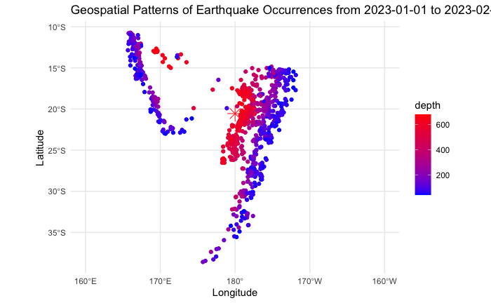
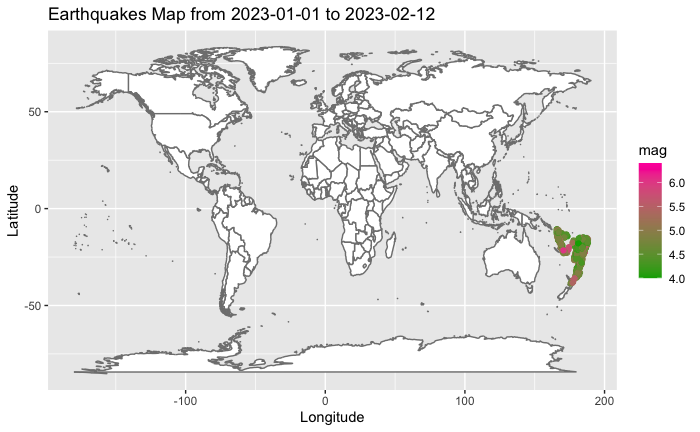
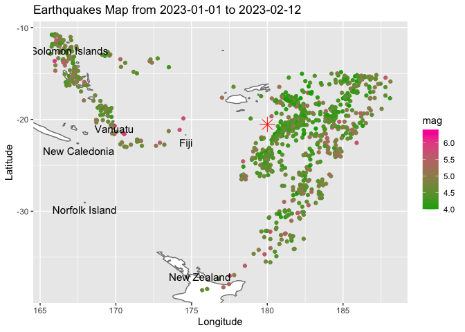
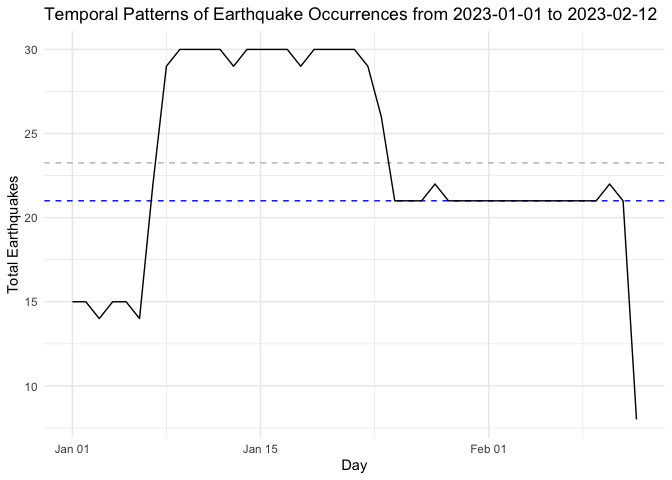
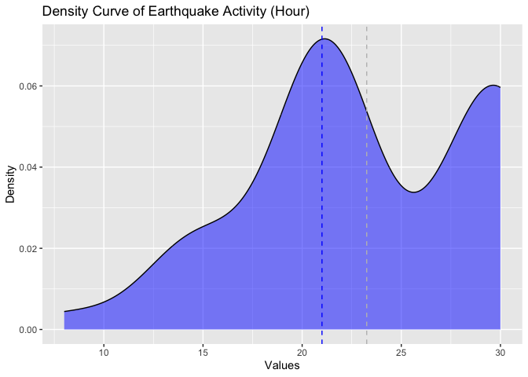
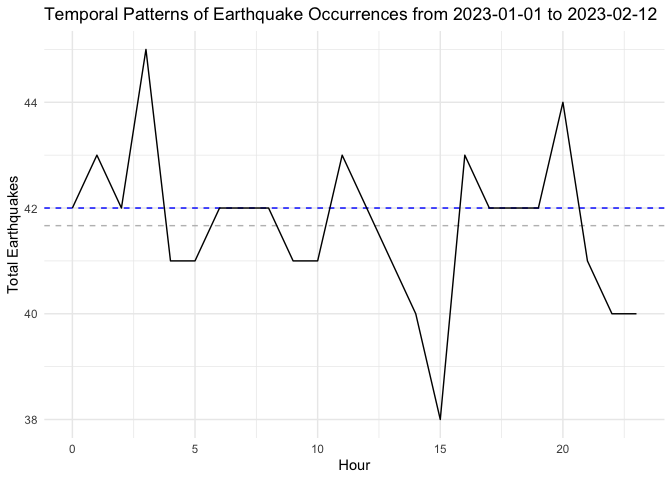
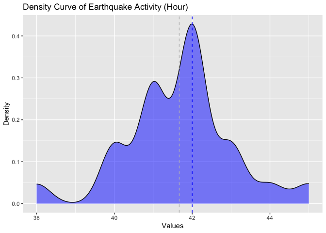

Geospatial analysis example using earthquake data ("quakes").

#### Import R Packages
```{r}
#install.packages("sf")
#install.packages("ggplot2")
#install.packages("dplyr")
#install.packages("maps")
#install.packages("stats")

library(sf)
library(ggplot2)
library(dplyr)
library(lubridate)
library(stats)
```
 

#### Read in Geospatial Dataset

Import earthquakes data set and world map. For earthquakes data set add a datetime column. 

```{r}
data("quakes")
world <- map_data('world')

# Define the start datetime
start_datetime <- as.POSIXct("2023-01-01 00:00:00", tz = "UTC")
# Define the time interval (in secs)
time_interval_a <- 5900  
time_interval_b <- 2900  
time_interval_c <- 4100  
# Generate 1000 datetime values
datetime_values_a <- seq(start_datetime, by = time_interval_a, length.out = 100)
last_value_a <- datetime_values_a[99]
datetime_values_b <- seq(last_value_a, by = time_interval_b, length.out = 500)
last_value_b <- datetime_values_b[500]
datetime_values_c <- seq(last_value_b, by = time_interval_c, length.out = 400)
datetime_values <- c(datetime_values_a, datetime_values_b, datetime_values_c)

quakes$datetime <- datetime_values
```

#### Explore the Data 

Create a spatial data frame and plot earthquake occurrences by coordinates. 
```{r}
# Create a spatial data frame
earthquakes_sf <- st_as_sf(quakes, coords = c("long", "lat"), crs = 4326)

x_axis_limits <- c(160, 200)
title <- paste("Geospatial Patterns of Earthquake Occurrences from", paste(as.Date(quakes$datetime[1]), as.Date(quakes$datetime[nrow(quakes)]), sep = " to "))

# Calculate the weighted average latitude and longitude
weighted_avg_latitude <- sum(quakes$lat * quakes$mag * quakes$depth) / sum(quakes$mag * quakes$depth)
weighted_avg_longitude <- sum(quakes$long * quakes$mag * quakes$depth) / sum(quakes$mag * quakes$depth)


# Plot earthquake locations on a map
ggplot() +
  geom_sf(data = earthquakes_sf, aes(color = depth)) +
  scale_color_gradient(low = "blue", high = "red") +
  geom_point(data = data.frame(lat = weighted_avg_latitude, long = weighted_avg_longitude), aes(x = long, y = lat), shape = 8, color = "red", size = 5) +
  theme_minimal() + 
  xlim(x_axis_limits) + 
  labs(x = "Longitude", y = "Latitude", title = title)
```
<a href='./images/unnamed-chunk-3-1.png'></a>


Plot earthquake occurrences by coordinates onto a world map. 

```{r}
world <- map_data('world')
title <- paste("Earthquakes Map from", paste(as.Date(quakes$datetime[1]), as.Date(quakes$datetime[nrow(quakes)]), sep = " to "))

# Plot geospatial patterns
ggplot() + geom_map(data = world, map = world, aes(x = long, y=lat, group=group, map_id=region), fill="white", colour="#7f7f7f", size=0.5) +
  geom_point(data = quakes, aes(x=long, y = lat, colour = mag)) + scale_colour_gradient(low = "#00AA00",high = "#FF00AA") +
  labs(x = "Longitude", y = "Latitude", title= title) 

```

<a href='./images/unnamed-chunk-4-1.png'></a>


Plot earthquake occurrences by coordinates onto a world map, localized to region. 

```{r}

# Plot geospatial patterns
p <- ggplot() + geom_map(data = world, map = world, aes(group=group, map_id=region), fill="white", colour="#7f7f7f", size=0.5) +
  geom_point(data = quakes, aes(x=long, y = lat, colour = mag)) + scale_colour_gradient(low = "#00AA00",high = "#FF00AA") +
  labs(x = "Longitude", y = "Latitude", title= title) 

# Get the visible x and y limits of the plot
x_limits <- layer_scales(p)$x$get_limits()
y_limits <- layer_scales(p)$y$get_limits()

# Calculate the weighted average latitude and longitude
weighted_avg_latitude <- sum(quakes$lat * quakes$mag * quakes$depth) / sum(quakes$mag * quakes$depth)
weighted_avg_longitude <- sum(quakes$long * quakes$mag * quakes$depth) / sum(quakes$mag * quakes$depth)

# Filter the labels to include only the relevant regions
relevant_labels <- subset(world, long >= x_limits[1] & long <= x_limits[2] & lat >= y_limits[1] & lat <= y_limits[2])
unique_labels <- relevant_labels[!duplicated(relevant_labels$region), ]

# Add relevant region labels to the plot
p + geom_text(data = unique_labels, aes(x = long, y = lat, label = region), vjust = 1.5, size = 4) + 
  geom_point(data = data.frame(lat = weighted_avg_latitude, long = weighted_avg_longitude), aes(x = long, y = lat), shape = 8, color = "red", size = 5)

```
<a href='./images/unnamed-chunk-5-1.png'></a>


Aggregate data by Day, and plot number of earthquake occurrences per day. 
```{r}
# Aggregate earthquakes by day
earthquakes_agg_day <- earthquakes_sf %>%
  group_by(day = as.Date(datetime)) %>%
  summarise(total_quakes = n())

title <- paste("Temporal Patterns of Earthquake Occurrences from", paste(as.Date(quakes$datetime[1]), as.Date(quakes$datetime[nrow(quakes)]), sep = " to "))

# Plot temporal patterns
ggplot(earthquakes_agg_day, aes(x = day, y = total_quakes)) +
  geom_hline(yintercept = mean(earthquakes_agg_day$total_quakes), linetype = "dashed", color = "grey") + 
  geom_hline(yintercept = median(earthquakes_agg_day$total_quakes), linetype = "dashed", color = "blue") + 
  geom_line() +
  labs(x = "Day", y = "Total Earthquakes", title = title) +
  theme_minimal()

# Plot Density curve
ggplot(data = earthquakes_agg_day, aes(x = total_quakes)) +
  geom_density(fill = "blue", alpha = 0.5) +  
  geom_vline(xintercept = mean(earthquakes_agg_day$total_quakes), linetype = "dashed", color = "grey") +  
  geom_vline(xintercept = median(earthquakes_agg_day$total_quakes), linetype = "dashed", color = "blue") + 
  labs(title = "Density Curve of Earthquake Activity (Hour)", x = "Values", y = "Density")
```

<a href='./images/unnamed-chunk-6-1.png'></a>

<a href='./images/unnamed-chunk-6-2.png'></a>


Aggregate data by Hour, and plot number of earthquake occurrences per hour. 
```{r}
# Aggregate earthquakes by hour
earthquakes_agg_hour <- earthquakes_sf %>%
  group_by(hour = lubridate::hour(datetime)) %>%
  summarise(total_quakes = n())


# Plot temporal patterns
ggplot(earthquakes_agg_hour, aes(x = hour, y = total_quakes)) +
  geom_hline(yintercept = mean(earthquakes_agg_hour$total_quakes), linetype = "dashed", color = "grey") + 
  geom_hline(yintercept = median(earthquakes_agg_hour$total_quakes), linetype = "dashed", color = "blue") + 
  geom_line() +
  labs(x = "Hour", y = "Total Earthquakes", title = title) +
  theme_minimal()

# Plot Density curve
ggplot(data = earthquakes_agg_hour, aes(x = total_quakes)) +
  geom_density(fill = "blue", alpha = 0.5) +  
  geom_vline(xintercept = mean(earthquakes_agg_hour$total_quakes), linetype = "dashed", color = "grey") +  
  geom_vline(xintercept = median(earthquakes_agg_hour$total_quakes), linetype = "dashed", color = "blue") + 
  labs(title = "Density Curve of Earthquake Activity (Hour)", x = "Values", y = "Density")

```

<a href='./images/unnamed-chunk-7-1.png'></a>

<a href='./images/unnamed-chunk-7-2.png'></a>


#### Evaluate Significance of Earthquake Occurrences 

Evaluate statistical significance of earthquake occurrences by day. 

```{r}
# Aggregate earthquakes by day
earthquakes_agg_day <- earthquakes_sf %>%
  group_by(day = as.Date(datetime)) %>%
  summarise(total_quakes = n())

observed <- earthquakes_agg_day$total_quakes

# Expected earthquake counts (assuming uniform distribution)
expected <- rep(mean(observed), length(observed))

# Perform Chi-squared test
chi_squared_result <- chisq.test(observed, p = expected / sum(expected))

# Print the Chi-squared test result
print(chi_squared_result)

# Interpret the result
if (chi_squared_result$p.value < 0.05) {
  cat("The occurrence of earthquakes is significantly different from randomness (reject H0).\n")
} else {
  cat("There is no significant difference from randomness in earthquake occurrence (fail to reject H0).\n")
}

# Perform regression analysis 
earthquake_data <- data.frame(Day = factor(earthquakes_agg_day$day), Count = earthquakes_agg_day$total_quakes)

# Fit a Poisson regression model
poisson_model <- glm(Count ~ Day, data = earthquake_data, family = poisson)

# Summary of the Poisson regression model
summary(poisson_model)
```

```

    Chi-squared test for given probabilities

data:  observed
X-squared = 62.272, df = 42, p-value = 0.02266


The occurrence of earthquakes is significantly different from randomness (reject H0).

```

```
Call:
glm(formula = Count ~ Day, family = poisson, data = earthquake_data)

Coefficients:
                Estimate Std. Error z value Pr(>|z|)    
(Intercept)    2.708e+00  2.582e-01  10.488   <2e-16 ***
Day2023-01-02 -1.010e-14  3.651e-01   0.000   1.0000    
Day2023-01-03 -6.899e-02  3.716e-01  -0.186   0.8527    
Day2023-01-04 -1.101e-14  3.651e-01   0.000   1.0000    
Day2023-01-05 -9.776e-15  3.651e-01   0.000   1.0000    
Day2023-01-06 -6.899e-02  3.716e-01  -0.186   0.8527    
Day2023-01-07  3.830e-01  3.348e-01   1.144   0.2527    
Day2023-01-08  6.592e-01  3.180e-01   2.073   0.0382 *  
Day2023-01-09  6.931e-01  3.162e-01   2.192   0.0284 *  
Day2023-01-10  6.931e-01  3.162e-01   2.192   0.0284 *  
Day2023-01-11  6.931e-01  3.162e-01   2.192   0.0284 *  
Day2023-01-12  6.931e-01  3.162e-01   2.192   0.0284 *  
Day2023-01-13  6.592e-01  3.180e-01   2.073   0.0382 *  
Day2023-01-14  6.931e-01  3.162e-01   2.192   0.0284 *  
Day2023-01-15  6.931e-01  3.162e-01   2.192   0.0284 *  
Day2023-01-16  6.931e-01  3.162e-01   2.192   0.0284 *  
Day2023-01-17  6.931e-01  3.162e-01   2.192   0.0284 *  
Day2023-01-18  6.592e-01  3.180e-01   2.073   0.0382 *  
Day2023-01-19  6.931e-01  3.162e-01   2.192   0.0284 *  
Day2023-01-20  6.931e-01  3.162e-01   2.192   0.0284 *  
Day2023-01-21  6.931e-01  3.162e-01   2.192   0.0284 *  
Day2023-01-22  6.931e-01  3.162e-01   2.192   0.0284 *  
Day2023-01-23  6.592e-01  3.180e-01   2.073   0.0382 *  
Day2023-01-24  5.500e-01  3.242e-01   1.696   0.0898 .  
Day2023-01-25  3.365e-01  3.381e-01   0.995   0.3196    
Day2023-01-26  3.365e-01  3.381e-01   0.995   0.3196    
Day2023-01-27  3.365e-01  3.381e-01   0.995   0.3196    
Day2023-01-28  3.830e-01  3.348e-01   1.144   0.2527    
Day2023-01-29  3.365e-01  3.381e-01   0.995   0.3196    
Day2023-01-30  3.365e-01  3.381e-01   0.995   0.3196    
Day2023-01-31  3.365e-01  3.381e-01   0.995   0.3196    
Day2023-02-01  3.365e-01  3.381e-01   0.995   0.3196    
Day2023-02-02  3.365e-01  3.381e-01   0.995   0.3196    
Day2023-02-03  3.365e-01  3.381e-01   0.995   0.3196    
Day2023-02-04  3.365e-01  3.381e-01   0.995   0.3196    
Day2023-02-05  3.365e-01  3.381e-01   0.995   0.3196    
Day2023-02-06  3.365e-01  3.381e-01   0.995   0.3196    
Day2023-02-07  3.365e-01  3.381e-01   0.995   0.3196    
Day2023-02-08  3.365e-01  3.381e-01   0.995   0.3196    
Day2023-02-09  3.365e-01  3.381e-01   0.995   0.3196    
Day2023-02-10  3.830e-01  3.348e-01   1.144   0.2527    
Day2023-02-11  3.365e-01  3.381e-01   0.995   0.3196    
Day2023-02-12 -6.286e-01  4.378e-01  -1.436   0.1510    
---
Signif. codes:  0 ‘***’ 0.001 ‘**’ 0.01 ‘*’ 0.05 ‘.’ 0.1 ‘ ’ 1

(Dispersion parameter for poisson family taken to be 1)

    Null deviance: 6.6346e+01  on 42  degrees of freedom
Residual deviance: 6.1284e-14  on  0  degrees of freedom
AIC: 299.08

Number of Fisher Scoring iterations: 3
```


Evaluate statistical significance of earthquake occurrences by hour. 

```{r}
# Aggregate earthquakes by day
earthquakes_agg_hour <- earthquakes_sf %>%
  group_by(hour = lubridate::hour(datetime)) %>%
  summarise(total_quakes = n())

observed <- earthquakes_agg_hour$total_quakes

# Expected earthquake counts (assuming uniform distribution)
expected <- rep(mean(observed), length(observed))

# Perform Chi-squared test
chi_squared_result <- chisq.test(observed, p = expected / sum(expected))

# Print the Chi-squared test result
print(chi_squared_result)

# Interpret the result
if (chi_squared_result$p.value < 0.05) {
  cat("The occurrence of earthquakes is significantly different from randomness (reject H0).\n")
} else {
  cat("There is no significant difference from randomness in earthquake occurrence (fail to reject H0).\n")
}

# Perform regression analysis 
earthquake_data <- data.frame(Hour = factor(earthquakes_agg_hour$hour), Count = earthquakes_agg_hour$total_quakes)

# Fit a Poisson regression model
poisson_model <- glm(Count ~ Hour, data = earthquake_data, family = poisson)

# Summary of the Poisson regression model
summary(poisson_model)

```

```
    Chi-squared test for given probabilities

data:  observed
X-squared = 1.136, df = 23, p-value = 1

There is no significant difference from randomness in earthquake occurrence (fail to reject H0).
```

```
Call:
glm(formula = Count ~ Hour, family = poisson, data = earthquake_data)

Coefficients:
              Estimate Std. Error z value Pr(>|z|)    
(Intercept)  3.738e+00  1.543e-01  24.223   <2e-16 ***
Hour1        2.353e-02  2.169e-01   0.108    0.914    
Hour2       -5.251e-15  2.182e-01   0.000    1.000    
Hour3        6.899e-02  2.146e-01   0.322    0.748    
Hour4       -2.410e-02  2.195e-01  -0.110    0.913    
Hour5       -2.410e-02  2.195e-01  -0.110    0.913    
Hour6       -5.241e-15  2.182e-01   0.000    1.000    
Hour7       -5.245e-15  2.182e-01   0.000    1.000    
Hour8       -5.237e-15  2.182e-01   0.000    1.000    
Hour9       -2.410e-02  2.195e-01  -0.110    0.913    
Hour10      -2.410e-02  2.195e-01  -0.110    0.913    
Hour11       2.353e-02  2.169e-01   0.108    0.914    
Hour12      -5.238e-15  2.182e-01   0.000    1.000    
Hour13      -2.410e-02  2.195e-01  -0.110    0.913    
Hour14      -4.879e-02  2.209e-01  -0.221    0.825    
Hour15      -1.001e-01  2.239e-01  -0.447    0.655    
Hour16       2.353e-02  2.169e-01   0.108    0.914    
Hour17      -5.237e-15  2.182e-01   0.000    1.000    
Hour18      -5.233e-15  2.182e-01   0.000    1.000    
Hour19      -5.229e-15  2.182e-01   0.000    1.000    
Hour20       4.652e-02  2.157e-01   0.216    0.829    
Hour21      -2.410e-02  2.195e-01  -0.110    0.913    
Hour22      -4.879e-02  2.209e-01  -0.221    0.825    
Hour23      -4.879e-02  2.209e-01  -0.221    0.825    
---
Signif. codes:  0 ‘***’ 0.001 ‘**’ 0.01 ‘*’ 0.05 ‘.’ 0.1 ‘ ’ 1

(Dispersion parameter for poisson family taken to be 1)

    Null deviance: 1.1383e+00  on 23  degrees of freedom
Residual deviance: 1.3767e-14  on  0  degrees of freedom
AIC: 181.7

Number of Fisher Scoring iterations: 3
```


